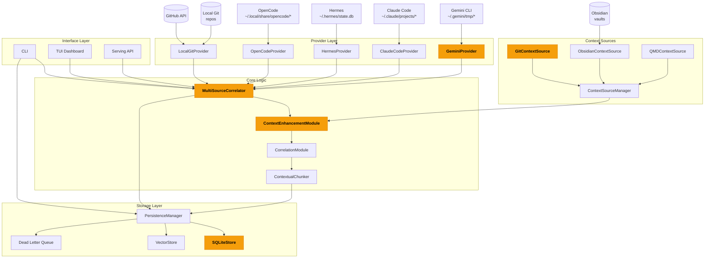

# Recall

> **Recall transforms** raw AI session data from multiple platforms (Gemini, Claude, Hermes, OpenCode, Git, GitHub, Obsidian) **into** structured insights, contextual correlations, and unified workstream narratives **through** DSPy-powered AI analysis and multi-source context enrichment **for** developers seeking to reconstruct and understand their past work.

## What This Codebase Produces *(Material Processes — High Certainty)*

Recall **transforms** heterogeneous session formats (JSON, JSONL, SQLite, markdown) **into** standardized session objects, extracted insights, and synthesized cross-platform narratives **through** a pipeline of:
1. Provider-specific extraction (Gemini CLI, Claude Code, Hermes, OpenCode, Git)
2. Normalization to unified session schema
3. DSPy-based insight extraction and analysis
4. Context enrichment from Obsidian notes and Git history
5. Multi-source correlation and timeline synthesis
6. Persistent storage in SQLite with vector embeddings via ChromaDB

**Technical Contract**:
- **Input**: Session files from `~/.gemini/`, `~/.hermes/`, `~/.claude/`, `~/.local/share/opencode/`, Git repos, GitHub API, Obsidian vaults
- **Process**: Extraction → Normalization → Analysis → Enrichment → Correlation → Persistence
- **Output**: Structured session data, insights, correlations, searchable embeddings, DLQ for failed items
- **Performance**: Parallel extraction via `ThreadPoolExecutor`, provider-specific named rate limiters, WAL-enabled SQLite for concurrent writes

## Key Concepts *(Most-Connected Nodes from Knowledge Graph)*

| Concept | Role | Connected To | Confidence |
|---------|------|-------------|------------|
| `MultiSourceCorrelator` | Core correlation engine that synthesizes sessions across providers | `ContextEnhancementModule`, `GeminiProvider`, `HermesProvider`, SQLiteStore | EXTRACTED |
| `SQLiteStore` | Primary persistence layer for sessions, messages, insights | `PersistenceManager`, `VectorStore`, DLQ | EXTRACTED |
| `GeminiProvider` | Extracts sessions from Gemini CLI JSON files | `BaseProvider`, `SessionUsage`, `Settings` | EXTRACTED |
| `GitContextSource` | Enhances insights with relevant Git commit history | `ContextSourceManager`, `Settings` | EXTRACTED |
| `ContextEnhancementModule` | DSPy module for enriching insights with contextual information | `CorrelationModule`, `MultiSourceCorrelator` | EXTRACTED |
| `main()` | CLI entry point and orchestrator | `CLI commands`, `TUI`, all providers | EXTRACTED |
| `HermesProvider` | Extracts sessions from Hermes Agent SQLite and JSON files | `BaseProvider`, `SessionUsage` | EXTRACTED |
| `debug()` | Cross-cutting logging/debugging utility | All modules (37 edges) | INFERRED |
| `error()` | Cross-cutting error handling utility | All modules (22 edges) | INFERRED |

*Source: graphify god nodes — highest-degree nodes in the knowledge graph (593 nodes, 935 edges).*

## Architecture Overview *(Relational Processes)*

## Surprising Connections

The knowledge graph revealed unexpected cross-module relationships that merit attention:

- **`OpenCode Provider` --captures_failures_from--> `Persistent Dead Letter Queue`** [INFERRED]
  *OpenCode sessions that fail during extraction are routed to the persistent DLQ for later retry.*

- **`Settings` --uses--> `GitContextSource`** [INFERRED]
  *Configuration settings directly influence Git context source behavior, suggesting Git integration is configurable at the system level.*

- **`ContextSource` --uses--> `GitContextSource`** [INFERRED]
  *The base context source interface delegates to Git-specific implementations.*

- **`create_context_manager()` --calls--> `GitContextSource`** [INFERRED]
  *Context manager initialization includes Git context source setup.*

- **`SessionUsage` --uses--> `GeminiProvider`** [INFERRED]
  *Usage tracking for sessions is tied to the Gemini provider.*

## What Varies by Context *(Mental Processes — Conditional Modality)*

- **Simple scenarios**: Users **typically focus on** extracting and correlating sessions from a single provider (e.g., Gemini only) and **often find** the CLI interface sufficient for their needs.

- **Complex cases may** involve multiple providers simultaneously, requiring the full correlation pipeline to resolve cross-platform session relationships.

- **Results depend on** the quality and completeness of session data in each provider's storage format. Some providers (Gemini CLI) have well-structured JSON, while others require SQLite parsing or filesystem discovery.

- **Performance may vary** based on the number of sessions being processed and the configured rate limits for each provider.

## Questions This Graph Can Answer

The knowledge graph is uniquely positioned to answer:

- **Why does `Settings` connect `Local Community` to `Core Logic`, `Recall Community`, `Context Management`?**
  *High betweenness centrality (0.262) — this node is a cross-community bridge.*

- **Why does `debug()` connect `Core Logic` to `SQLite Storage`, `AI & DSPy Modules`, `Obsidian Community`, `Context Management`, `Vector Storage`, `Limiter Community`?**
  *High betweenness centrality (0.161) — this logging utility is woven throughout the system.*

- **Are the 33 inferred relationships involving `debug()` (e.g. with `.register_source()` and `.initialize()`) actually correct?**
  *`debug()` has 33 INFERRED edges — model-reasoned connections that need verification.*

- **Are the 21 inferred relationships involving `error()` (e.g. with `.initialize()` and `.enhance_insights()`) actually correct?**
  *`error()` has 21 INFERRED edges — model-reasoned connections that need verification.*

## Module Documentation

Detailed per-module documentation is available:

| Module | File | Description |
|--------|------|-------------|
| `ai.md` | `docs/modules/ai.md` | AI modules: chunking, DSPy signatures, analysis modules |
| `db.md` | `docs/modules/db.md` | Database layer: SQLite, VectorStore, PersistenceManager |
| `providers.md` | `docs/modules/providers.md` | Provider implementations: Gemini, Claude, Hermes, OpenCode, Git |
| `core.md` | `docs/modules/core.md` | Core pipeline: MultiSourceCorrelator orchestration |
| `cli.md` | `docs/modules/cli.md` | CLI interface: commands, TUI dashboard |
| `config.md` | `docs/modules/config.md` | Configuration: Pydantic settings, API keys |

## Data Flow

See [`docs/data-flow.md`](data-flow.md) for detailed sequence diagrams of:
- Primary extraction and correlation flow
- Semantic search operation
- DLQ retry mechanism

## Design Decisions

See [`docs/decisions.md`](decisions.md) for architecture rationale extracted from inline comments.

## Ruby Pragmatist Overview

Recall works like a forensic accountant rather than a crystal ball — it **systematically reconstructs** what you worked on across all your development tools **by correlating timestamps, code changes, and AI session content**, while **requiring you to provide the source data and interpret the narratives it generates**, much like how a detective pieces together a timeline from scattered evidence but cannot infer motives without context.
