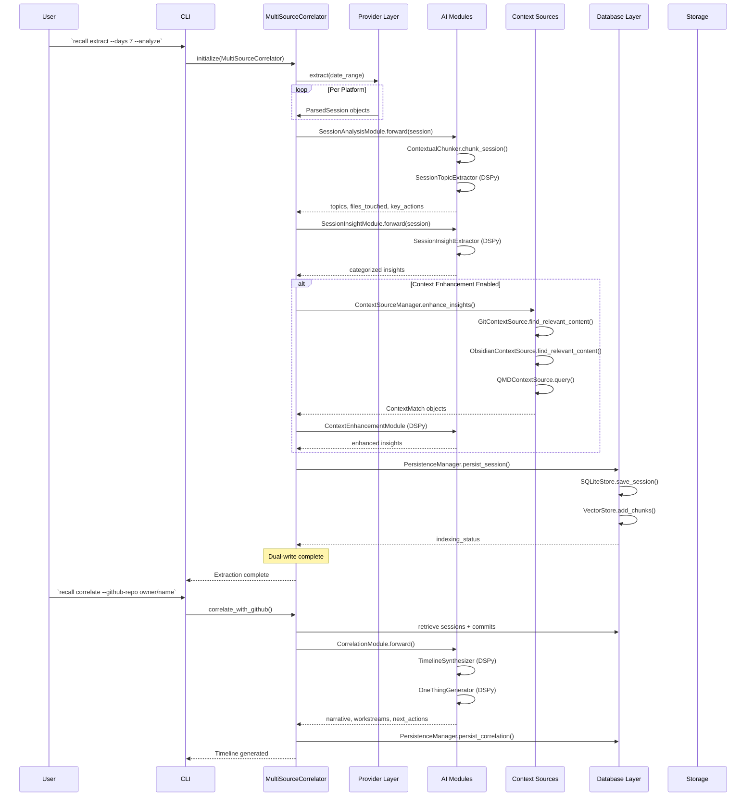
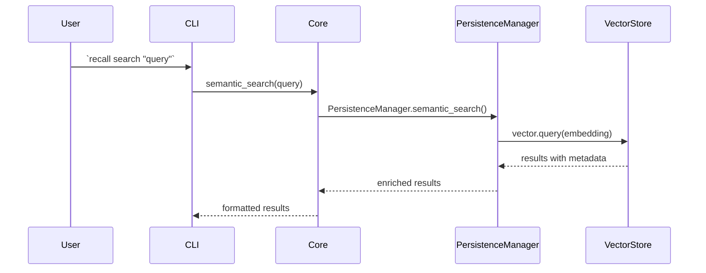
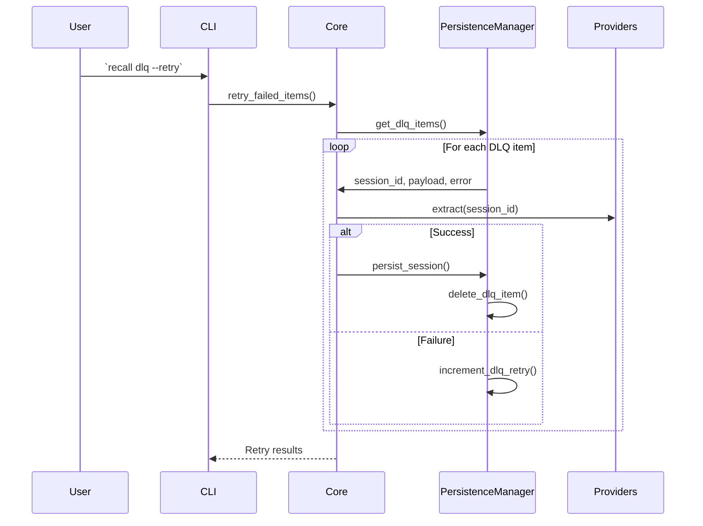

# Data Flow

**Transformation Pipeline**: session data → extraction → normalization → analysis → context enrichment → correlation → persistence → search

## Primary Operation: Session Extraction and Correlation

## Secondary Flows

### Semantic Search

### DLQ Retry

## Transformation Pipeline

1. **[Input Stage]**: Platform-specific session files and APIs **provide** raw session data at user-specified date ranges through provider implementations
2. **[Extraction Stage]**: `BaseProvider.extract()` **converts** platform-specific formats into `ParsedSession` objects with normalized message structures
3. **[Analysis Stage]**: `SessionAnalysisModule` and `SessionInsightModule` **transform** raw sessions **into** topics, key actions, and categorized insights using DSPy
4. **[Enrichment Stage]**: `ContextEnhancementModule` **enhances** base insights **with** contextual matches from Git, Obsidian, and QMD sources (optional)
5. **[Correlation Stage]**: `CorrelationModule` **synthesizes** multi-source data (sessions + commits + file changes) **into** unified timeline and workstream narratives
6. **[Persistence Stage]**: `PersistenceManager` **persists** sessions to SQLite and chunks to ChromaDB via dual-write with indexing status tracking
7. **[Search Stage]**: `semantic_search()` **queries** ChromaDB embeddings with metadata filtering to retrieve relevant session context

## Critical Paths

- **[Extraction Path]**: Provider → ParsedSession → AI Analysis → Persistence — this is the core data path that all features depend on
- **[Search Path]**: Query → Embedding → Vector Search → Metadata Join → Results — enables discovery and retrieval
- **[Correlation Path]**: Sessions + Commits → TimelineSynthesizer → Narrative — the highest-value feature for cross-platform understanding

## Error Handling Data Flow

Failed operations follow a resilience pattern:
1. Provider extraction errors → logged with `error()`, session may be skipped
2. AI analysis errors → logged, insights default to empty
3. Vector indexing failures → recorded in DLQ for retry
4. SQLite commit failures → raises exception (dual-write resilience: vector not written)
5. DLQ reconciliation retries → limited by `retry_max_attempts` setting
