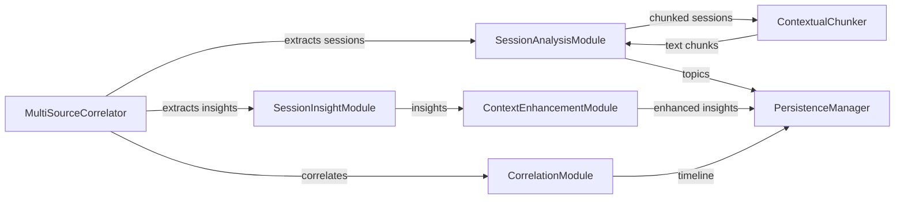

# AI Modules

**Location**: `src/recall/ai/`
**Confidence**: EXTRACTED

## Transformation Contract

The AI module **transforms** raw session content (chat transcripts, tool outputs, thinking blocks) **into** structured insights, topics, and correlations **through** DSPy-powered LLM analysis with contextual chunking **when** the `dspy` package is available; falls back to keyword-based extraction when unavailable.

> The AI modules work like a team of specialized analysts — each DSPy module has a distinct role (topic extraction, insight categorization, timeline synthesis) **while** the chunking layer ensures no single message overwhelms the analysis pipeline, much like how a lead investigator breaks a complex case into manageable interviews rather than reading raw transcripts end-to-end.

## Responsibilities

- Provide DSPy-powered AI analysis pipeline for session content
- Intelligently chunk sessions based on temporal and semantic boundaries
- Extract topics, files touched, and key actions from sessions
- Generate categorized insights (technical, procedural, strategic, blockers)
- Correlate sessions across platforms and time
- Enhance insights with contextual information from multiple sources
- Support multi-provider LLM backends (OpenRouter, OpenAI, Ollama)

## Key Components

| Component | Type | Transformation / Role | Confidence |
|-----------|------|-----------------------|------------|
| `ContextualChunker` | class | **splits** a `ParsedSession` **into** ordered text chunks (6000 chars max, 30-min time gaps) | EXTRACTED |
| `SessionTopicExtractor` | Signature | **extracts** 3-5 topics + files touched + key actions **from** session chunk | EXTRACTED |
| `SessionInsightExtractor` | Signature | **categorizes** insights into TECHNICAL/PROCEDURAL/STRATEGIC/BLOCKER **from** session content | EXTRACTED |
| `SessionAnalysisModule` | DSPy Module | **analyzes** a session **into** topics, files, and key actions | EXTRACTED |
| `SessionInsightModule` | DSPy Module | **extracts** categorized insights and primary theme **from** a session | EXTRACTED |
| `CorrelationModule` | DSPy Module | **synthesizes** multi-source timeline (sessions + commits + file changes) **into** narrative and workstreams | EXTRACTED |
| `ContextEnhancementModule` | DSPy Module | **enriches** base insights **with** context matches from Obsidian/Git/QMD | EXTRACTED |
| `TimelineSynthesizer` | Signature | **generates** coherent narrative from sessions, commits, and file changes | EXTRACTED |
| `OneThingGenerator` | Signature | **identifies** the single highest-leverage next action | EXTRACTED |
| `CommitSessionCorrelator` | Signature | **matches** a git commit to relevant sessions | EXTRACTED |

## Dependencies

**Requires**:
- `dspy` — DSPy framework for LLM-powered signatures and modules (optional; falls back to keyword extraction)
- `recall.models` — `ParsedSession`, `SessionInsights`, `ContextMatch` data structures
- `recall.logging` — `debug()`, `error()` for structured logging
- `recall.utils.limiter` — rate limiting for LLM API calls

**Enables**:
- `PersistenceManager` — receives chunked sessions for vector embedding
- `Core Pipeline` (`MultiSourceCorrelator`) — provides analysis and insight extraction

## Interactions



## What Users / Developers Experience

- **First encounter**: Developers **typically focus on** the `SessionAnalysisModule` and `SessionInsightModule` classes as the entry points for AI-powered analysis
- **After regular use**: The `ContextualChunker` chunk size (6000 chars) and time gap (30 min) parameters **may need tuning** for sessions with unusually long messages or rapid-fire exchanges
- **Performance**: Rate limiting via named limiters (`"embeddings"`, `"llm"`) ensures API calls stay within RPM limits; DSPy modules use `ChainOfThought` for reasoning

## Known Limitations

**Works well when**: Session transcripts are well-structured with clear tool calls and outputs, and the LLM provider is responsive
**May struggle with**: Extremely long sessions (1000+ messages) where chunking may produce many small fragments; sessions with minimal text content (only tool calls with no reasoning)
**Requires workarounds for**: DSPy unavailability — falls back to basic keyword-based extraction that lacks semantic understanding

## Code Snippets

### Chunking a session
```python
from recall.ai.chunking import ContextualChunker
from recall.models import ParsedSession

chunker = ContextualChunker(max_chunk_chars=6000, time_gap_minutes=30)
chunks = chunker.chunk_session(session)  # Returns List[str]
```

### Extracting topics via DSPy
```python
from recall.ai.modules import SessionAnalysisModule
from recall.models import ParsedSession

analyzer = SessionAnalysisModule()
result = analyzer.forward(session)  # Returns {"topics": [...], "files_touched": [...], "key_actions": [...]}
```

## Ruby Pragmatist Insight

The AI module pipeline works like a research team with distinct specializations — the chunker acts as the note-taker who breaks raw transcripts into digestible segments, the topic extractor identifies the research themes, and the insight module categorizes findings — **each role depends on the others' outputs**, much like how a research paper depends on methodology, data, and analysis being properly sequenced.
