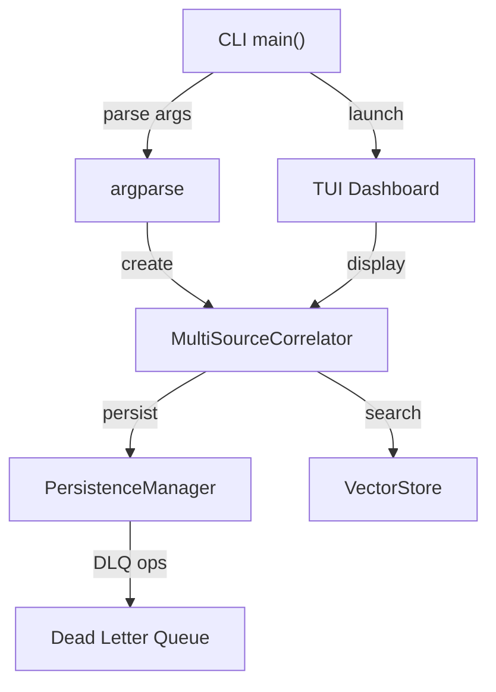

# CLI Interface

**Location**: `src/recall/cli.py`
**Confidence**: EXTRACTED

## Transformation Contract

The CLI **transforms** user commands (extract, correlate, search, dlq) **into** structured operations against the recall data model **through** argparse subcommands with JSON output support **when** the appropriate platform data is available; provides TUI dashboard mode for interactive visualization.

> The CLI works like a command center operator — it **translates** high-level user intentions ("extract sessions", "search insights") **into** specific operations against the data model, **while** the TUI mode provides a visual operations center for monitoring progress in real-time, much like how an air traffic controller translates pilot requests into runway assignments.

## Responsibilities

- Parse user commands (extract, correlate, search, dlq) via argparse
- Override settings from CLI flags
- Display results in table/JSON format
- Launch TUI dashboard mode
- Handle embedding dimension compatibility checks
- Support JSON output for scripting integration
- Provide callback-based progress reporting for TUI integration

## Key Components

| Component | Type | Transformation / Role | Confidence |
|-----------|------|-----------------------|------------|
| `main()` | function | **parses** CLI args **into** `MultiSourceCorrelator` operations | EXTRACTED |
| `serialize_value()` | function | **converts** dataclass objects **into** JSON-serializable structures | EXTRACTED |
| `serialize_item()` | function | **serializes** a single dataclass item for JSON output | EXTRACTED |
| `extract` subcommand | command | **extracts** sessions from platforms with analysis | EXTRACTED |
| `correlate` subcommand | command | **correlates** sessions with GitHub and generates timeline | EXTRACTED |
| `search` subcommand | command | **queries** semantic search over saved sessions | EXTRACTED |
| `dlq` subcommand | command | **manages** Dead Letter Queue (list, retry, clear) | EXTRACTED |

## Dependencies

**Requires**:
- `recall.core.MultiSourceCorrelator` — the main pipeline orchestrator
- `recall.config.Settings` — configuration and API keys
- `rich` — terminal formatting and TUI dashboard

**Enables**:
- All CLI operations (extract, correlate, search, dlq)
- TUI dashboard visualization
- Scripting integration via JSON output

## Interactions



## What Users / Developers Experience

- **First encounter**: Users **typically start with** `recall extract --days 7 --analyze` to begin data collection
- **After regular use**: The `--overwrite` flag **may be needed** when re-running analysis with different models
- **JSON output**: Enables scripting and integration with other tools
- **TUI mode**: Provides interactive monitoring during long-running operations

## Known Limitations

**Works well when**: CLI arguments match the expected format; required API keys are configured
**May struggle with**: Very long JSON output that exceeds terminal buffer; complex nested data structures
**Requires workarounds for**: Embedding dimension mismatch — prompts user to choose wipe/re-embed/abort

## Code Snippets

### Running extraction
```bash
recall extract --days 7 --analyze --platforms gemini,hermes --output sessions.json
```

### Running correlation
```bash
recall correlate --days 7 --github-repo owner/name --output timeline.json
```

### Searching sessions
```bash
recall search "debugging authentication issue" --limit 5 --platform gemini
```

### Managing DLQ
```bash
recall dlq --list
recall dlq --retry
recall dlq --clear
```

## Ruby Pragmatist Insight

The CLI works like a dispatch console — it **translates** high-level operational commands **into** specific system actions, **while** the TUI dashboard provides real-time situational awareness for monitoring complex operations, much like how a network operations center translates alerts into actionable remediation steps.
