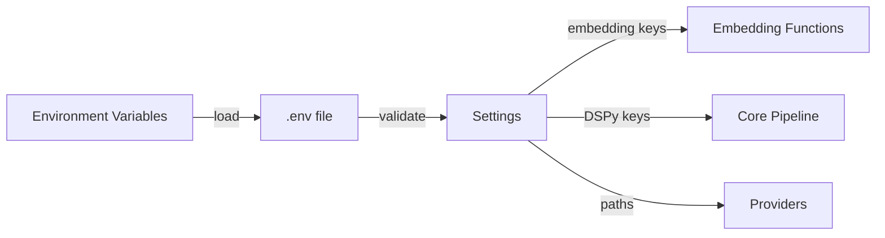

# Configuration

**Location**: `src/recall/config.py`
**Confidence**: EXTRACTED

## Transformation Contract

The configuration module **transforms** environment variables and `.env` files **into** typed `Settings` objects **through** Pydantic validation with field defaults and validators **when** the application initializes; supports per-platform API keys and provider-specific settings.

> The configuration module works like a diplomatic passport office — it **validates and stamps** user-provided credentials (API keys, paths) **into** a standardized travel document (`Settings`) that grants access to the system, **while** environment file loading ensures sensitive data isn't accidentally committed.

## Responsibilities

- Define all application settings via Pydantic `BaseSettings`
- Load configuration from environment variables and `.env` files
- Validate and transform raw input values (path expansion, JSON parsing)
- Support per-platform API keys (OpenRouter, OpenAI, Anthropic, Gemini, Mistral, HuggingFace)
- Configure rate limiting, embedding, and context enhancement parameters
- Provide field validators for complex types (context sources list)

## Key Components

| Component | Type | Transformation / Role | Confidence |
|-----------|------|-----------------------|------------|
| `Settings` | class | **validates** env vars **into** typed configuration object | EXTRACTED |
| `notebook_path` | field | **resolves** `~/Notebook` **into** absolute path | EXTRACTED |
| `workspace_path` | field | **resolves** `~/Workspace` **into** absolute path | EXTRACTED |
| `embedding_provider` | field | **selects** embedding backend (ollama, openai, mistral, huggingface) | EXTRACTED |
| `dspy_provider` | field | **configures** DSPy provider (openrouter, openai, ollama, mistral) | EXTRACTED |
| `context_sources` | field | **parses** context source list from JSON/env | EXTRACTED |
| `SecretStr` | type | **wraps** API keys for secure handling | EXTRACTED |

## Dependencies

**Requires**:
- `pydantic` — data validation and settings management
- `pydantic-settings` — environment file loading and validation
- `python-dotenv` — `.env` file support

**Enables**:
- All modules that need configuration (providers, core, db, context)
- Secure handling of API keys
- Flexible deployment via environment variables

## Interactions



## What Users / Developers Experience

- **First encounter**: Developers **typically start with** copying `.env.example` and filling in API keys
- **After regular use**: Path configurations **may need adjustment** for non-standard home directory locations
- **Security**: API keys are loaded from environment or `.env` files, not hardcoded
- **Flexibility**: Multiple embedding providers can be configured for different use cases

## Known Limitations

**Works well when**: Standard paths are used; API keys are valid and have appropriate permissions
**May struggle with**: Non-standard path conventions; missing `.env` file locations
**Requires workarounds for**: Context source parsing when invalid JSON is provided

## Code Snippets

### Basic usage
```python
from recall.config import Settings

settings = Settings()
print(settings.dspy_provider)  # "openrouter"
print(settings.embedding_provider)  # "ollama"
```

### With custom values
```python
settings = Settings(
    dspy_provider="openai",
    dspy_model="gpt-4o-mini",
    embedding_provider="openai",
    embedding_model="text-embedding-3-small"
)
```

### Loading from .env file
```bash
# .env file
DSPY_PROVIDER=openai
OPENAI_API_KEY=sk-...

# Code
settings = Settings()
```

## Ruby Pragmatist Insight

The configuration module works like a customs office — it **validates and processes** incoming credentials and settings **into** a standardized format that grants access to the system, **while** environment file loading ensures sensitive data isn't accidentally exposed in version control, much like how a customs declaration ensures goods meet regulations before entry.
