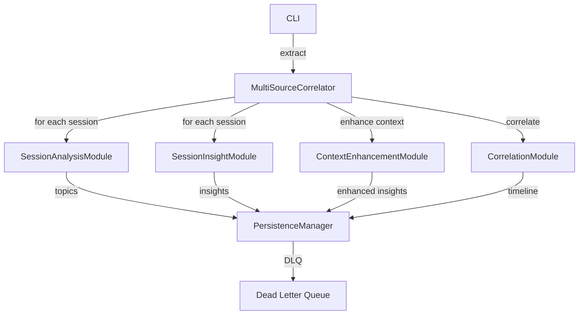

# Core Pipeline

**Location**: `src/recall/core.py`
**Confidence**: EXTRACTED

## Transformation Contract

The core pipeline **transforms** raw session data from multiple platforms **into** analyzed, correlated, and persisted workstream narratives **through** a multi-stage pipeline of extraction, analysis, context enrichment, and correlation **when** platform data is available; supports parallel processing via `ThreadPoolExecutor` with configurable analysis models.

> The core pipeline works like a forensic investigator — it **collects evidence from multiple crime scenes** (platforms), **analyzes each piece** to understand what happened, **cross-references** findings across sources, and **reconstructs** the complete timeline, **while** the rate limiter acts as the evidence custodian ensuring no single source overwhelms the investigation.

## Responsibilities

- Orchestrate multi-source session extraction and analysis
- Process sessions through AI-powered topic extraction and insight generation
- Cross-reference sessions with git commit history
- Generate cross-platform workstream narratives
- Manage parallel processing with thread pool and rate limiting
- Support context enhancement from Obsidian/Git/QMD sources
- Handle DLQ retries and failed session reconciliation

## Key Components

| Component | Type | Transformation / Role | Confidence |
|-----------|------|-----------------------|------------|
| `MultiSourceCorrelator` | class | **correlates** sessions across platforms and git history **into** unified narratives | EXTRACTED |
| `SessionAnalysisModule` | DSPy Module | **extracts** topics, files, and key actions **from** sessions | EXTRACTED |
| `SessionInsightModule` | DSPy Module | **categorizes** insights into TECHNICAL/PROCEDURAL/STRATEGIC/BLOCKER | EXTRACTED |
| `CorrelationModule` | DSPy Module | **synthesizes** multi-source timeline **into** narrative + workstreams | EXTRACTED |
| `ContextEnhancementModule` | DSPy Module | **enriches** insights **with** context from multiple sources | EXTRACTED |
| `_process_single_session()` | method | **analyzes** a single session in a thread pool | EXTRACTED |
| `reconcile_failed_vectors()` | method | **retries** failed vector indexing operations | EXTRACTED |

## Dependencies

**Requires**:
- All provider modules (Gemini, ClaudeCode, Hermes, OpenCode)
- `PersistenceManager` — for dual-write persistence
- `ContextSourceManager` — for context enhancement
- `Settings` — configuration and API keys
- Rate limiting infrastructure (`get_limiter`, `get_retry_decorator`)

**Enables**:
- `CLI` — entry point for extract/correlate/search operations
- `TUI` — dashboard display of extraction progress
- All downstream analysis and persistence

## Interactions



## What Users / Developers Experience

- **First encounter**: Developers **typically interact with** `MultiSourceCorrelator` as the main entry point for the extraction pipeline
- **After regular use**: The parallel processing configuration (`max_workers`, `requests_per_minute`) **may need tuning** for large-scale extractions
- **Context enhancement**: Optional enrichment with Obsidian/Git/QMD context adds latency but improves insight quality
- **DLQ handling**: Failed sessions are automatically retried on subsequent runs

## Known Limitations

**Works well when**: Session data is well-formed and API providers are responsive; rate limits are configured appropriately
**May struggle with**: Very large date ranges (30+ days) causing memory pressure; slow LLM providers increasing extraction time
**Requires workarounds for**: Context enhancement timeout (30s default); asyncio event loop conflicts in sync contexts

## Code Snippets

### Running the core extraction pipeline
```python
from recall.core import MultiSourceCorrelator
from recall.config import Settings

settings = Settings(requests_per_minute=20, max_workers=20)
correlator = MultiSourceCorrelator(settings=settings)

# Extract and analyze sessions
correlator.extract_and_analyze(
    days=7,
    platforms=["gemini", "hermes"],
    analyze=True
)
```

### Running correlation with GitHub
```python
correlator.correlate_with_github(
    github_repo="owner/name",
    days=7,
    enhance_context=True
)
```

## Ruby Pragmatist Insight

The core pipeline works like a field commander coordinating multiple intelligence sources — it **deploys extraction teams** (providers) to gather raw data, **analysts** (AI modules) to interpret findings, and **archivists** (persistence) to maintain records, **while** the rate limiter ensures no single source overwhelms the operation, much like how a commander balances priority between active operations and intelligence analysis.
